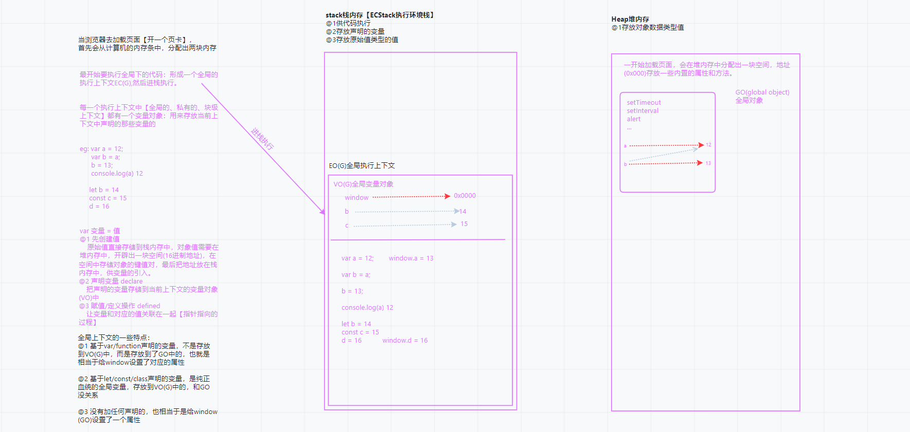
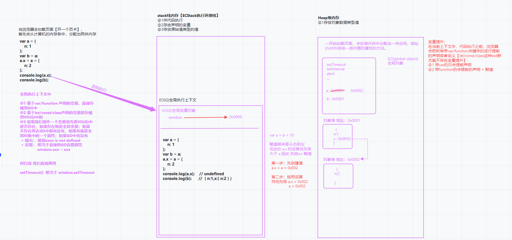

## 1.ECMAScript262中数据类型的标准定义

> **4.2 ECMAScript Overview**
> ECMAScript is object-based: basic language and host facilities are provided by objects, and an ECMAScript program is a cluster of communicating objects. In ECMAScript, an object is a collection of zero or more properties each with attributes that determine how each property can be used—for example, when the Writable attribute for a property is set to false, any attempt by executed ECMAScript code to assign a different value to the property fails. Properties are containers that hold other objects, primitive values, or functions. A primitive value is a member of one of the following built-in types: Undefined, Null, Boolean, Number, String, and Symbol; an object is a member of the built-in type Object; and a function is a callable object. A function that is associated with an object via a property is called a method.
> ECMAScript是基于对象的:基本语言和主机设施是由对象提供的，而ECMAScript程序是通信对象的集群。在ECMAScript中，对象是0个或多个属性的集合，每个属性都具有决定如何使用每个属性的属性——例如，当属性的可写属性被设置为false时，执行ECMAScript代码为属性分配不同值的任何尝试都将失败。属性是容纳其他对象、基本值或函数的容器。原始值是以下内置类型之一的成员:未定义、Null、布尔、数字、字符串和符号;对象是内置类型对象的成员;函数是可调用对象。通过属性与对象关联的函数称为方法。
>
> ECMAScript defines a collection of built-in objects that round out the definition of ECMAScript entities. These built-in objects include the global object; objects that are fundamental to the runtime semantics of the language including Object, Function, Boolean, Symbol, and various Error objects; objects that represent and manipulate numeric values including Math, Number, and Date; the text processing objects String and RegExp; objects that are indexed collections of values including Array and nine different kinds of Typed Arrays whose elements all have a specific numeric data representation; keyed collections including Map and Set objects; objects supporting structured data including the JSON object, ArrayBuffer, and DataView; objects supporting control abstractions including generator functions and Promise objects; and, reflection objects including Proxy and Reflect.
> ECMAScript定义了一个内置对象集合，它完善了ECMAScript实体的定义。这些内置对象包括全局对象;对象是语言运行时语义的基础，包括对象、函数、布尔值、符号和各种错误对象;表示和操作数值(包括数学、数字和日期)的对象;文本处理对象字符串和RegExp;对象，该对象是值的索引集合，包括数组和9种不同类型的数组，其元素都具有特定的数值数据表示;键控集合，包括Map和Set对象;支持结构化数据的对象，包括JSON对象、ArrayBuffer和DataView;支持控制抽象的对象，包括生成器函数和承诺对象;以及反射对象，包括代理和反射
- 原始值类型【值类型/基本数据类型】
  - number 数字
  - string 字符串
  - boolean 布尔
  - null 空对象指针
  - undefined 未定义
  - symbol 唯一值
  - bigint 大数
- 对象类型【引用数据类型】
  - 标准普通对象 object
  - 标准特殊对象 Array RegExp Date Math Error...
  - 非标准特殊对象 Number String Boolean
  - 可调用/执行对象 function
  
## 2.typeof数据类型检测的底层机制
- 特点1: 返回的结果是字符串，字符串中包含了对应的数据类型
  - ```js 
    typeof typeof typeof [1,2,3] //'string' 
    ```
- 特点2：按照计算机底层存储的二进制进行检测【效率高】
  - 000 对象
  - 1 整数
  - 010 浮点数
  - 100 字符串
  - 110 布尔
  - 0000... null
  - -2^30 undefined
  - ...
- 特点3：typeof null -> 'object'
- 特点4：typeof '对象' -> 'object' typeof '函数/class' -> 'function'
  
  - 验证是否是对象的判断
- 特点5：typeof '未被声明的变量' -> 'undefined'
  - 插件封装中的暴露API
  - ```js
     /*
      *  1.typeof  **
      *  2.instanceof
      *  3.constructor
      *  4.Object.prototype.toString.call([value])  **
      *  ---
      *  Array.isArray
      *  isNaN
      *  ...
      * 
      * typeof底层处理机制
      */

      // (function () {
      //     let utils = {
      //     };
      //     if (typeof window !== "undefined") window.utils = utils;
      //     if (typeof module === "object" && typeof module.exports === "object") module.exports = utils;
      // })();
      // utils.xxx();
     ```
## 3.JS底层存储机制:堆(Heap)、栈(Stack)内存
- 以下代码作为运行示例
```js
var a = 12;        //window.a = 13
var b = a;         
b = 13; 

console.log(a) 12


let b = 14
const c = 15
d = 16           //window.d = 16
```


- 以下代码作为运行示例
```js
var a = {
    n: 1
};

var b = a;

a.x = a = {
    n: 2
};

console.log(a.x);    // undefined    

console.log(b);      //  { n:1,x:{ n:2 } }

```



## 4.数据类型解读之 number、Symobol、BigInt
### 数字类型 number
- 整数、浮点数(小数)、正数、负数、零
- NaN: not a number 不是一个有效数字，但是它率属于number类型
  - `typeof NaN => 'number'`
  - 出现场景：经常出现在，把其他类型转换为数字的时候，如果无法转换为有效数字，结果就是NaN
  - NaN !== NaN NaN和任何值（包括自己本身），都不相等
  - isNaN([val]):检测val是否“不是个有效数字”，如果不是 返回true, 如果是有效数字，返回false. 如果val不是数字类型的，浏览器首先会将其隐式转换为number类型，然后进行检测.
  - Object.is(NaN, NaN) -> true ES6中提供的方法，不兼容IE浏览器
  - ```js
    //let n = ?
    //if (n === NaN) {
    //  条件永远无法成立
    //  console.log('n不是有效数字')
    //}
    let n = ?;
    if(isNaN(n)){
      console.log('n不是有效数字')
    }
    ```
- Infinity 无穷大的值
### Bigint
- Bigint 大数
  - JS中最大/最小的安全数字：`Number.MAX_SAFE_INTEGER / Number.MIN_SAFE_INTEGER/Math.pow(2,53) - 1`
  - `9007199254740991 -9007199254740991 16位`
  - 超过这个范围的值进行数字运算，结果是不准确的
  - 场景 服务器端存储的ID是一个很大的值【数据库我们可以基于longInt处理】，现在我们把这个值返回给客户端，客户端获取值之后，需要进行运算处理，如果超过安全数字，导致结果是不准确的.
  ```js
  Number.MAX_SAFE_INTEGER
  9007199254740991
  9007199254740991 + 10
  9007199254741000
  9007199254740991n + 10n
  9007199254741001n
  typeof 9007199254741001n
  "bigint"
  Bigint("90071992547409919007199254740991") -> 90071992547409919007199254740991n
  //一个数字后面加“n”就是BigInt
  //计算完成的超长结果，基于toString转换为字符串【会去掉n】,把这个值再传递给服务器即可
  ```
### Symbol
- Symbol唯一值类型
  - `Symbol() //创造一个唯一值
     Symnol('xxx') //创造一个唯一值，只不过设置了标记
    `
  - `new Symbol() Uncaught TypeError: Symbol is not a constructor //不允许被new执行`  
  - 用途1: 给对象设置一个唯一的属性【对象的成员只能是string & symbol 类型的值，Map允许属性名是不同类型的（包含对象）】
  - 用途2：它是很多内置机制的实现方式
    - `Symbol.toPrimitive`
    - `Symbol.hasInstance`
    - `Symbol.toStringTag`
    - ...
  - ```js
    console.log(Symbol('AA') === Symbol('AA')); //false 创造了两个唯一值
    let sy = Symbol('AA')
        ys = sy
    sonsole.log(ys === sy) //true 只创建了一个唯一值
    let key = Symbol('KEY')
    let obj = {
        //属性名：'name' 'age' '0' '1' Symbol() Symbol('KEY') '[object Object]'
        name:'zs',
        age:23,
        0:100,
        1:220,
        [Symbol()]:300,
        [key]:400,
        //把对象转换为字符串，去充当它的属性名
        [{
          name:'xxxx'
        }]:500
    }
    console.log(obj[Symbol()]) //undefined 用新创建的唯一值去获取，肯定获取不到
    console.log(obj[key]);//400
    console.log(obj[0]);//100 -> obj['0']
    ```
## 数据类型转换
### 把其他数据类型转换为number
- `Number([val])`
  - 一般用于浏览器的隐式转换中
  - 规则：
  1. 把字符串转换为数字：空字符串变为0，如果出现任何一个非有效数字字符，结果都是NaN
  2. 把布尔值转换为数字 true -> 1 false -> 0
  3. null -> 0 undefined -> NaN
  4. Symbol无法转化为数字，会报错：Uncaught TypeError: Cannot convert a Symbol value to a number
  5. Bigint去除n（超过安全数字的，会按照科学计数法处理）
  6. 把对象转换为数字
    - 先调用对象的Symbol.toPrimitive这个方法，如果不存在这个方法
    - 再调用对象的valueOf获取原始值，如果获取的值不是原始值
    - 再调用对象的toString把其变为字符串
    - 最后再把字符串基于Number方法转换为数字
- parseInt([val],[radix])
- parseFloat([val])
  - 一般用于手动转换
  - 规则：[val]值必须是一个字符串，如果不是则先转换为字符串；然后从字符串左侧第一个字符开始找，把找到的有效数字字符最后转换为数字【一个都没找到就是NaN】;遇到一个非有效数字字符，不论后面是否还有有效数字字符，都不再查找了；parseFloat可以多识别一个小数点   
```js
let arr = [27.2, 0, '0013', '14px', 123]
arr = arr.map(parseInt)
/*
parseInt(27.2，0)
  // 27.2 ->  '272.2' -> '27'  -> 把 '27' 看做10进制，转换为10进制 => 27
parseInt(0,1) => NaN

parseInt('0013', 2) 
  // '0013' -> '001' ->把'001'看做2进制，转换为10进制 => 1
  0*2^2 + 0*2^1 + 1*2^0 = 1
parseInt('14px', 3)
  // '14px' -> '1' -> 把'1'看做是3进制，转换为10进制 => 1
  1 * 3^0
parseInt('123', 4)
  // '123' -> 把'123'看做是4进制，转换为10进制 =>27 
  1*4^2  2*4^1  3*4^0  
parseInt传递的第二个值是一个radix进制
  + radix不写或者写0，默认是10进制【如果第一个传递的字符串是以‘0x’开始的,那么默认是16进制】
  + radix取值范围：2~36，不在这个范围内，处理的结果都是NaN
  + 在传递的字符串中.从左到右，找到符合radix进制的值(遇到不符合的则结束查找），把找到的值，看做radix进制，最后转化为10进制
  + 把其它进制的值转换为10进制：‘按权展开求和’
*/
console.log(arr) // [27, NaN, 1, 1, 27]
```  
### 把其他类型转换为布尔
- 除了0/NaN/空字符串/null/undefined五个值是false,其余都是true
